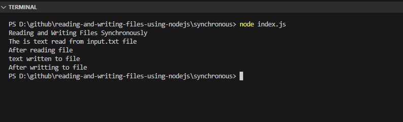
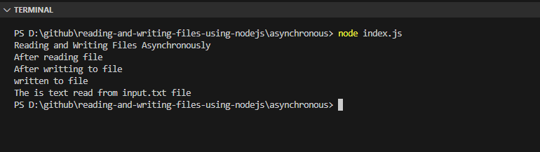

# Reading and writing files using Node.js
## Synchronous
 1. open the terminal
 2. cd to synchronous folder
 3. run node index.js command
 #### Output
 
 
## Asynchronous
 1. open the terminal
 2. cd to asynchronous folder
 3. run node index.js command
 #### Output
 
